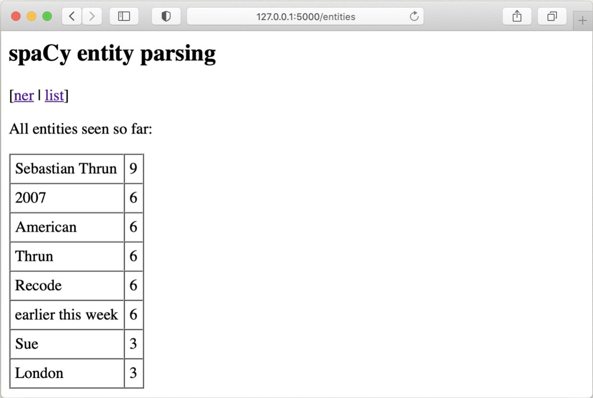

# Assignment 3 - Adding a database

This assignment is due March 29th. Send me an archive with all code and instructions on what to install and how to run your code.

With your previous assignment you built a Flask service that wraps your Named Entity Extraction code in both a RESTful API and a mini website. With the API you were able to send a GET request that returns some boilerplate and a POST request to parse an input file with plain text and get the marked up version.

```bash
$> curl http://127.0.0.1:5000/api
$> curl -X POST -d@input.txt http://127.0.0.1:5000/api
```

At the same time, you would be able to point your browser at [http://127.0.0.1:5000/](http://127.0.0.1:5000/) (without the `api` suffix) and then see a page like the one on the left, click submit and see a page like the one on the right.

&nbsp;


For this assignment we look only at the website. You should take your existing code, or the [example code](https://github.com/marcverhagen/CS138A/blob/main/code/assignments/part2-flask) posted on the class website, and add functionality to store how often a string is found as a named entity. This database starts of empty, but once you process "Sue lives in London." both "Sue" and "London" will end in a database table with counts set to 1. And at any time you can access a page [http://127.0.0.1:5000/entities](http://127.0.0.1:5000/entities) where you can see the counts.

&nbsp;

In order to do this you need to take the output from the NER component which was an XML string, and parse it to extract the entity texts. The easiest way to do that is to install the Beautiful Soup package.

```bash
$> pip install beautifulsoup4
```

And then use it to extract the text

```python
>>> from bs4 import BeautifulSoup
>>> markup = '<markup><entity class="PERSON">Sue</entity> is in <entity class="GPE">London</entity>.</markup>'
>>> soup = BeautifulSoup(markup, features="html.parser")
>>> entity_names = [ent.text for ent in soup.find_all('entity')]
```

You can also change the output of your NER script and make it return lists of entities.
